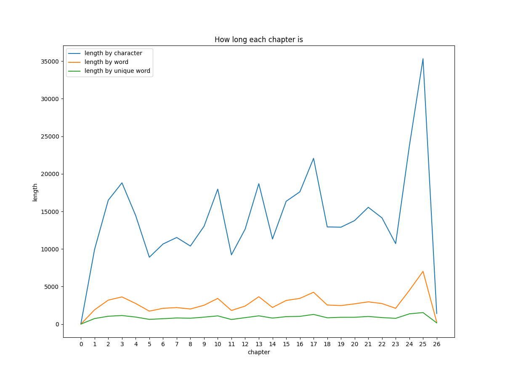
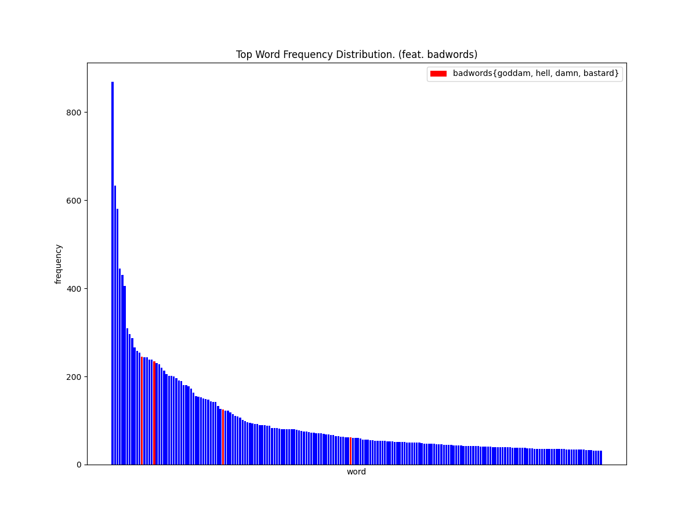
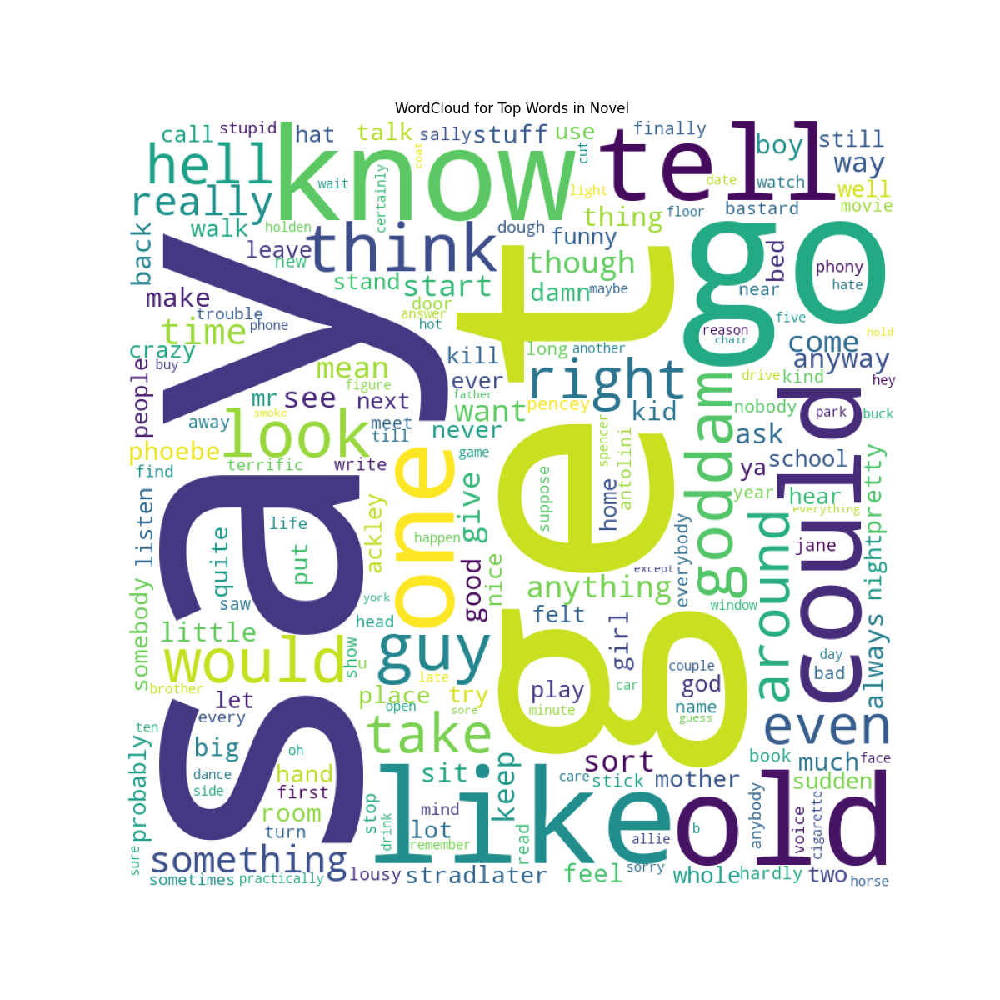

# 데이터로 읽은 책: 호밀밭의 파수꾼 (The Catcher in the Rye)

**호밀밭의 파수꾼 영문판을 데이터 분석을 통해 샅샅히 파헤쳐본다.**
[블로그 링크](https://dhsong10.tistory.com/50)

---

## Q1. 호밀밭의 파수꾼의 길이는?

```
python question1.py
```

길이를 계산하는 방법은 크게 세 가지로 구분한다.

1. 알파벳 글자수
2. 띄어쓰기(공백)를 기준으로 나누어진 단어의 수
3. 띄어쓰기(공백)를 기준으로 나누어진 단어의 수 중복을 제거한 수

상식적으로 (1) > (2) > (3) 순으로 글자 수가 많이 집계될 것이며 전체적인 분포는 큰 차이가 없을 것이다.

단어의 수에 대한 자세한 통계는 [CSV 파일](./output/dataframes/q1-book_length_information.csv)에서 확인할 수 있다.




총 26장(0장은 책의 간지)으로 구성된 호밀밭의 파수꾼 영문판은 25장에 이르러서 많은 내용이 쏟아진다. 

<details>
    <summary>스포일러</summary>

```
25장은 주인공 홀든 콜필드와 피비 콜필드가 서사를 이끌어간다. 뉴욕을 탈출하고자 하는 홀든과 그러한 오빠를 따아가겠다는 피비. 홀든을 피비를 타일르고 뉴욕을 떠나지 않기로 마음먹는다. 그리고 그들은 놀이공원에 간다. 홀든은 피비가 회전 목마를 타는 모습을 기쁘게 바라보면서 홀든의 사흘간의 뉴욕 방황기가 끝이난다.
```

</details>

---


## Q2. 호밀밭의 파수꾼에는 정말 욕이 많을까?

```
python question2.py
```

호밀밭의 파수꾼과 관련한 논쟁 중 하나는, 소설에서 홀든 콜필드가 욕설을 많이 한다는데 있다. 따라서 단어 빈도 분석을 통해 정말 욕설이 소설에 많이 등장하는지 살펴본다.

소설에 등장하는 챕터별 단어 빈도에 대한 [CSV 파일](./output/dataframes/q2-word_frequency_information.csv)을 확인하면 챕터별로 단어와 그 빈도수를 파악할 수 있다.

하지만, 전체를 다 볼 수는 없으니 전체 소설을 대상으로 상위 200개의 단어에 대한 빈도를 파악해본다. [CSV 파일](./output/dataframes/q2-top_word_frequency_information.csv)



상위 200개의 단어 분포를 파악하고, 그 안에 욕설이 얼마나 포함되어 있는지 살펴본다. 결과적으로 여타의 소설에 비해서 욕설이 많은 것은 사실이다. godddam, hell, damm, bastart와 같은 구어적 욕설 표현이 상위 100위 안에 위치한 것으로 보아 소설 내에서 빈번히 등장하는 것을 확인할 수 있다.

상위 200개의 단어가 무엇인지 워드 클라우드를 통해 살펴본다.



## Q3. 호밀밭의 파수꾼에서 주요한 인물들과 관련된 단어는?

```
python question3.py
```

Negative Sampling SkipGram 기반의 word2vec을 사용해서 유사한 단어들을 찾아본다.

### Holden과 유사한 단어

소설의 주인공 Holden과 긴밀하게 연결된 단어는 다음과 같다.

|단어|유사도|
|---|----|
|caulfield|0.7685014605522156|
|bein|0.7494996786117554|
|esq|0.7236199378967285|
|grendel|0.7149597406387329|
|randal|0.7020297050476074|
|thanks|0.6955091953277588|
|well|0.6922035217285156|
|skirt|0.6833012700080872|
|magic|0.6756631135940552|
|4b|0.6755202412605286|

우선 Hodle의 성인 Caulfield가 가장 높은 유사도를 보인다. 당연히 Holden Caulfield와 같이 Full Name으로 등장하였기 때문에 충분히 납득이 된다.

특히 눈에 띄는 것은 4b이다. 4b는 Phoebe의 약어로서 Holden이 유일하게 좋아하는 인물인데, 소설 속에서 Holden과 같이 많이 언급되는 것으로 보인다.
